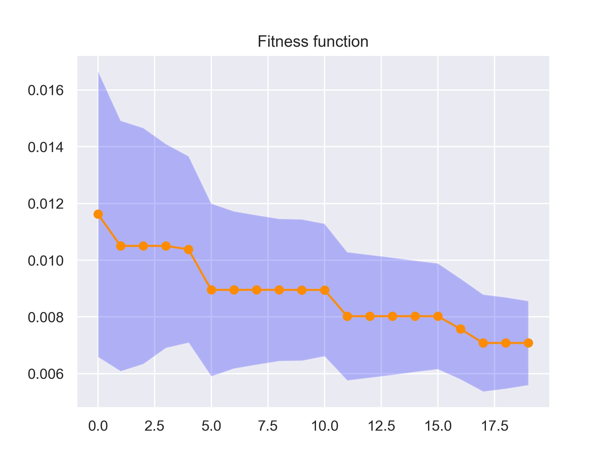
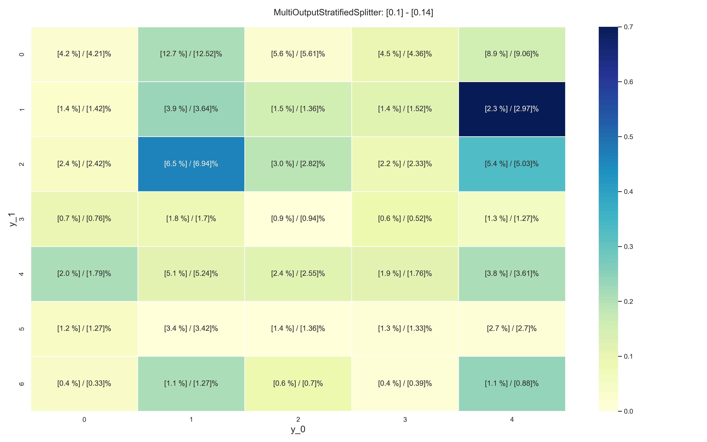
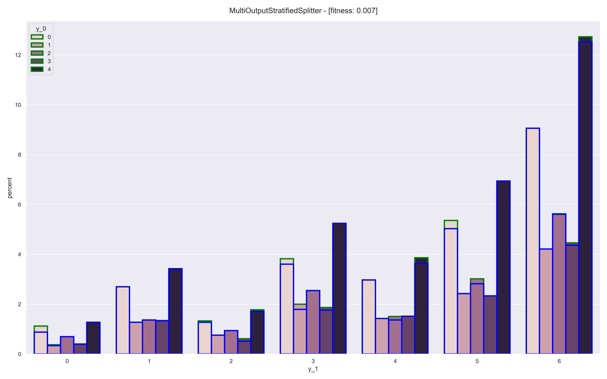
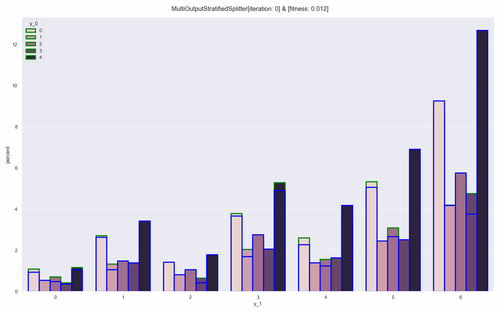

# MultiOutputStratified Splitting

This method provides train/test indices according to multiple target columns. It is suitable for applications involving `multiclass-multioutput classification`<sup>[1]</sup> in which one has access to multiple targets and each target has the cardinality strictly greater than 2. \
The implementation uses a genetic algorithm and it is inspired by the `EvoSplit algorithm`<sup>[2]</sup>. Furthermore, I have used various useful resources<sup>[3, 4, 5, 6]</sup> for the `Cython implementation` of the underlying genetic algorithm, and the codes are heavily inspired by the `scikit-learn` API design<sup>[7]</sup>. \
It is worth emphasizing that the original <i>EvoSplit</i> algorithm was devised for <i>multilabel classification</i> tasks, where there are multiple target columns but each target admits only binary values (0 or 1). Thus, our algorithm is an adaptation of <i>EvoSplit</i> to <i>multiclass-multioutput classification</i> tasks, where each target can have multiple categorical values. In order to generalize the aforementioned method, we have adapted the fitness function in order to accomodate the multiple cardinality of each target.


## Theoretical framework
Let $d$ to be the number of input features, $p$ to be the number of targets, and $N$ to denote the number of samples. Then, a `multioutput-multiclass dataset` is defined as $\mathcal{D} = \lbrace (x_i, y_i) \rbrace_{i = \overline{1, \ldots, N}}$, where the sample associated to the $i^{th}$ observation consists of $x_i \in \mathbb{R}^d$ and $y_i \in \mathbb{R}^p$. Using these notations, the input matrix is defined as 
```math 
X = 
\begin{pmatrix}
x_1^T \\
\ldots \\
x_N^T
\end{pmatrix}
\in \mathbb{R}^{N \times d}
```

For a multioutput target sample $y_i$, we define the one-dimensional target components as $y_i^{[k]} \in \mathbb{R}$ for $k \in \lbrace 1, \ldots, p \rbrace$. For every target column index $k \in \lbrace 1, \ldots, p \rbrace$, we denote 
```math
\textbf{y}^{[k]} = 
\begin{pmatrix}
y_1^{[k]} \\
\ldots \\
y_N^{[k]}
\end{pmatrix}
\in \mathbb{R}^N
```
Therefore, the `multioutput target matrix` can be written as 
```math
Y = 
\begin{pmatrix}
\textbf{y}^{[1]}, \ldots, \textbf{y}^{[p]} 
\end{pmatrix} \in \mathbb{R}^{N \times p}
```

Our aim is to split $\mathcal{D}$ into 2 disjoint subsets $\mathcal{D}\_{train}$ and $\mathcal{D}\_{test}$, of desired lengths $N_{train}$ and $N_{test}$, respectively. As a loss function, we consider a modified version of the `Label Distribution measure`<sup>[2]</sup> adapted to the <i>multiclass-multioutput</i> setting:
```math
\mathcal{L} = \dfrac{1}{2p} \sum\limits_{k = 1}^{p} \left( \left\| \dfrac{\Lambda_{train}^{[k]}}{N_{train} - \Lambda_{train}^{[k]}} - \dfrac{\Lambda^{[k]}}{N - \Lambda^{[k]}} \right\|_{\mathcal{L}_1} + \left\| \dfrac{\Lambda_{test}^{[k]}}{N_{test} - \Lambda_{test}^{[k]}} - \dfrac{\Lambda^{[k]}}{N - \Lambda^{[k]}} \right\|_{\mathcal{L}_1} \right)
```
where we have used the following notations: 
* $\Lambda^{[k]}$ is the vector of the counts corresponding to the unique values of the $k^{th}$ target output associated to the samples belonging to the original dataset $\mathcal{D}$
* $\Lambda_{subset}^{[k]}$ is the vector of the counts corresponding to the unique values of the $k^{th}$ target output associated to the samples belonging to $\mathcal{D}_{s}$, where $subset \in \lbrace \text{train, test} \rbrace$

## Parameters of the <i>MultiOutputStratifiedSplitter</i>
* <u><i>n_iterations</i></u> <b>[int]</b>: number of learning stages of the genetic algorithm
* <u><i>test_size</i></u> <b>[float]</b>: the proportion of the dataset representing the test subset 
* <u><i>population_size</i></u> <b>[int]</b>: number of genetic algorithm's individuals
* <u><i>mutation_rate</i></u> <b>[float | int]</b>: the percentage/number of the indices which need to be swapped between the train & test partitions of each individual.
* <u><i>crossover_rate</i></u> <b>[float | int]</b>: the percentage/number of indices which need to be swapped between two individuals. As stated in the original <i>EvoSplit</i> algorithm, in order to preserve the train/test split percentages, we use a correction process by randomly reassigning extra train indices to the test subset and vice versa. 
* <u><i>n_individuals_by_mutation</i></u> <b>[int]</b>: number of new individuals generated at each iteration by mutation
* <u><i>n_individuals_by_crossover</i></u> <b>[int]</b>: number of new individuals generated at each iteration by crossover
* <u><i>sample_with_replacement</i></u> <b>[bool]</b>: specifies if the parents considered in the mutation and crossover processes are drawn with replacement or not
* <u><i>verbose</i></u> <b>[bool]</b>: enables the printing of the fitness values at each iteration
* <u><i>random_state</i></u> <b>[None | int | np.random.RandomState]</b>: parameter which can lead to reproducible experiments

## Installation
The first thing to do is to install the Python packages mentioned in <b>`requirements.txt`</b> and then compile the Cython code for the genetic algorithm using 
```
python setup.py build_ext --inplace
```
inside the <b>`src`</b> folder.

## Running the code
Similar to scikit-learn, after defining the `MultiOutputStratifiedSplitter` (defined in <b>src/splitter.py</b>)
```
stratified_splitter = \
MultiOutputStratifiedSplitter(n_iterations = n_iterations,
                              test_size = test_size,
                              population_size = population_size,
                              mutation_rate = mutation_rate, 
                              crossover_rate = crossover_rate,
                              n_individuals_by_mutation = n_individuals_by_mutation,
                              n_individuals_by_crossover = n_individuals_by_crossover,
                              sample_with_replacement = sample_with_replacement,
                              verbose = verbose,
                              random_state = random_state
                            )
```
one can train it by a simple <i>fit</i> call:
```
X_train, X_test, y_train, y_test = stratified_splitter.fit(X, y)
```
If one just wants to try the stratifier, we made a synthetic dataset generator where each target output $\textbf{y}^{[k]}$ is generated according to chosen probabilities. For this one can use
```
data = CustomDataset(n_samples = n_samples, 
                     n_outputs = n_outputs,
                     random_state = random_state)
X, y = data.generate_data()
```
Here, the `CustomDataset` is a particular case of the `Dataset` class from <b>`src/dataset.py`</b>, which can generate the multioutput target $Y$ as follows:
```
data = Dataset(n_samples = n_samples, 
               n_features = n_features,
               n_classes = n_classes,
               random_state = random_state)
X, y = data.generate_data(p_list)
```
More precisely, the <i>n_classes</i> parameter is a list containing the number of unique values for each target column $\textbf{y}^{[k]}$. At the same time, <i>p_list</i> represents a list of dictionaries, where each dictionary corresponds to a target column $\textbf{y}^{[k]}$. For an index $k$, the keys of the $k^{th}$ dictionary represent the unique values of the target columns, and the dictionary values are the probabilities corresponding corresponding to those keys. The method of generating the synthetic dataset consists in making the product of the probabilities of the target columns for each sample, and then generating the $k$ outputs corresponding to each sample with the corresponding joint probability. \
After training the `MultiOutputStratifiedSplitter`, one can plot the fitness values at each iteration and the standard deviation of the fitnesses from each iteration, respectively:
```
plot_losses(losses = stratified_splitter.losses, 
            stds = stratified_splitter.stds,
            save_path = save_path
            )
```
 \
If one wants to plot the heatmap containing the percentages of the counts for each unique value with respect to the train/test subsets, one can call
```
plot_counts(y = y, 
            data_indices = [stratified_splitter.train_idx,      
                            stratified_splitter.test_idx], 
            random_state = stratified_splitter.random_state,
            title = 'MultiOutputStratifiedSplitter',
            save_path = '../results/'
            )
```
 \
Alternatively, for plotting the distribution of the counts corresponding to the target outputs, one can use
```
plot_distributions(y = y, 
                   data_indices = [stratified_splitter.train_idx,
                                   stratified_splitter.test_idx], 
                  losses = stratified_splitter.losses,
                  random_state = stratified_splitter.random_state,
                  title = 'MultiOutputStratifiedSplitter',
                  save_path = '../results/'
                )
```
 \
For making a <i>gif animation</i> concerning the distribution of the counts, we have considered a separate function that does this:
```
make_gif_distributions(y = y, 
                      data_indices = [stratified_splitter.train_indices,
                                      stratified_splitter.test_indices], 
                      losses = stratified_splitter.losses,
                      random_state = stratified_splitter.random_state,
                      title = method_name,
                      gif_fps = n_iterations // 20,
                      animation_interval = 200,
                      save_path = save_path
                    )
```
 \
Finally, if one wants to infer the best parameters for the stratified splitting, the one can use the `grid_search_param` function defined in <b>`src/splitter.py`</b>, i.e.
```
(stratified_splitter, 
best_params) = grid_search_param(X = X,
                                 y = y,
                                 random_state = random_state,
                                 test_size = test_size,
                                 n_iterations = n_iterations,
                                 population_size = population_size,
                                 mutation_rate = mutation_rate,
                                 crossover_rate = crossover_rate,
                                 n_individuals_by_mutation =  n_individuals_by_mutation,
                                 n_individuals_by_crossover = n_individuals_by_crossover,
                                 sample_with_replacement = sample_with_replacement
                                )
```
It is worth mentioning the following:
- In order to simplify the visualization of the plots involving the counts and their percentages, if the dimensionality of the multioutput target, i.e. $k$ (defined as <i>n_outputs</i>) exceeds $4$ then maximum $6$ subplots are generated, involving randomized pairs of target columns.
- The percentages depicted in the counts heatmap are computed using the distributions of the percentages of each unique values corresponding to different pairs of target columns. Furthermore, the heatmap's title represents the medians and the standard deviations of the percentages corresponding to each pair consisting of target columns.
- The best parameters for the <i>grid_search_param</i> are found by choosing the parameters for which the mean of the sum of the medians and the standard deviation (mentioned previously) has the lowest value.

For other technical details regarding the usage of the `MultiOutputStratifiedSplitter`, check the examples from <b>`src/main.py`</b>. Furthermore, check the folder <b>`results`</b> for the results that we have obtained for some experiments involving different combinations of data parameters & genetic algorithm hyper-parameters.


## References
1. [MultiOutput-MultiClass classification in scikit-learn](https://scikit-learn.org/stable/modules/multiclass.html)
2. [Florez-Revuelta, Francisco. "Evosplit: An evolutionary approach to split a multi-label data set into disjoint subsets." Applied Sciences 11.6 (2021): 2823.](https://www.mdpi.com/2076-3417/11/6/2823)
3. [Cython implementation of DecisionTreeClassifier in scikit-learn](https://github.com/scikit-learn/scikit-learn/tree/main/sklearn/tree)
4. [Cython implementation of HistGradientBoostingClassifier in scikit-learn](https://github.com/scikit-learn/scikit-learn/tree/main/sklearn/ensemble/_hist_gradient_boosting)
5. <span style="color:lightblue">Smith, Kurt W. "Cython: A Guide for Python Programmers". O'Reilly Media, Inc., 2015.</span>
6. [Cython's online documentation](https://cython.readthedocs.io/en/latest/index.html)
7. [Buitinck, Lars, et al. "API design for machine learning software: experiences from the scikit-learn project." arXiv preprint arXiv:1309.0238 (2013).](https://github.com/scikit-learn/scikit-learn)

## Additional resources
1. `Genetic algorithms`:
    * [Machine Learning Mastery. Simple Genetic Algorithm From Scratch in Python](https://machinelearningmastery.com/simple-genetic-algorithm-from-scratch-in-python/)
    * [Brownlee, Jason. FastGeneticAlgorithm](https://github.com/Jason2Brownlee/FastGeneticAlgorithm)
    * [Luke, Sean. Essentials of Metaheuristics. 2009](https://cs.gmu.edu/~sean/book/metaheuristics/Essentials.pdf)

2. `C (C++) \& Cython`:
    * Sorting:
        * [Sorting in Cython](https://stackoverflow.com/questions/38254146/sort-memoryview-in-cython)
        * [Argsort in Cython](https://github.com/jcrudy/cython-argsort/blob/master/cyargsort/argsort.pyx)
        * [Argsort in C](https://stackoverflow.com/questions/36714030/c-sort-float-array-while-keeping-track-of-indices)
    * Numpy C functions:
        * [np.where](https://github.com/dpilger26/NumCpp/blob/master/include/NumCpp/Functions/where.hpp)
        * [np.union1d](https://github.com/dpilger26/NumCpp/blob/master/include/NumCpp/Functions/union1d.hpp)
        * [np.nonzero](https://github.com/dpilger26/NumCpp/blob/master/include/NumCpp/Functions/nonzero.hpp)
    * Conversions:
        * [Utility function for the conversion of np.ndarray to C++ std::valarray](https://gist.github.com/kbarbary/4c367a05a151bd680e1cf94a97a32635)
    * Numpy types:
        * [Numpy type & Cython identifier](https://stackoverflow.com/questions/21851985/difference-between-np-int-np-int-int-and-np-int-t-in-cython)
        * [Understanding data types](https://jakevdp.github.io/PythonDataScienceHandbook/02.01-understanding-data-types.html)
        * [Retrieving the Python type from the C-level type](https://stackoverflow.com/questions/50981091/cython-how-to-get-the-actual-python-type-type-code-dtype-from-c-level-type)
    * C containers:
        * [Set](https://en.cppreference.com/w/cpp/container/set)
        * [Map](https://en.cppreference.com/w/cpp/container/map)
        * [Cython iteration through maps](https://stackoverflow.com/questions/51686143/cython-iterate-through-map)
        * [Cython wrapper for the C sets](https://github.com/cython/cython/blob/master/Cython/Includes/libcpp/set.pxd)
        * [Cython wrapper for the C maps](https://github.com/cython/cython/blob/master/Cython/Includes/libcpp/map.pxd)
    * Shape of Cython memoryviews:
        * [Cython returns an 8D list instead of a 2D tuple](https://groups.google.com/g/cython-users/c/xheRGGOiuYw)
    * Indexing:
        * [Indexing memoryviews with multiple indices](https://stackoverflow.com/questions/53831835/indexing-cython-memoryview-using-memoryview-of-ints)
    * Cython exceptions:
        * [Exception handling when returning a memoryview](https://stackoverflow.com/questions/50684977/cython-exception-type-for-a-function-returning-a-typed-memoryview)
    * Printing at the C level:
        * [Print size_t variables portably in C](https://stackoverflow.com/questions/2524611/how-can-one-print-a-size-t-variable-portably-using-the-printf-family)
        * [Print ssize_t variables in C](https://stackoverflow.com/questions/586928/how-should-i-print-types-like-off-t-and-size-t)
    * Fused types & Numpy arrays:
        * [Mapping Numpy types to C-level types using a given fused type](https://github.com/cython/cython/issues/4932)
        * [Numpy types & C types](https://cython.readthedocs.io/en/latest/src/userguide/numpy_tutorial.html#more-generic-code)
    * Creating Numpy arrays from existing data at the C-level
        * [Exposing C-computed arrays in Python without data copies](https://gael-varoquaux.info/programming/cython-example-of-exposing-c-computed-arrays-in-python-without-data-copies.html)

3. `scikit-learn`:
    * [Shuffling method - sklearn.utils](https://github.com/scikit-learn/scikit-learn/blob/main/sklearn/utils/_indexing.py#L564)
    * [Resampling method - sklearn.utils](https://github.com/scikit-learn/scikit-learn/blob/main/sklearn/utils/_indexing.py#L414)
    * [Random state checking - sklearn.validation](https://github.com/scikit-learn/scikit-learn/blob/main/sklearn/utils/validation.py#L1375)
    * [Validation of parameters - sklearn._param_validation](https://github.com/scikit-learn/scikit-learn/blob/main/sklearn/utils/_param_validation.py#L25)
    * [Interval class - sklearn._param_validation](https://github.com/scikit-learn/scikit-learn/blob/main/sklearn/utils/_param_validation.py#L397)
    * [Representing real numbers that are not instances of int - sklearn._param_validation](https://github.com/scikit-learn/scikit-learn/blob/main/sklearn/utils/_param_validation.py#L231)
    * [Computing train & test size - sklearn.model_selection.split](https://github.com/scikit-learn/scikit-learn/blob/main/sklearn/model_selection/_split.py#L2336)

4. `misc`:
    * [Python decorator to measure computational time](https://dev.to/kcdchennai/python-decorator-to-measure-execution-time-54hk)
    * [Make probabilities sum to 1](https://stackoverflow.com/questions/71262481/how-to-avoid-roundoff-errors-in-numpy-random-choice/71400320#71400320)
    * [Add text values to seaborn's heatmaps](https://stackoverflow.com/questions/41164710/how-to-add-text-plus-value-in-python-seaborn-heatmap)
    * [Numpy typings](https://numpy.org/devdocs/reference/typing.html)
    * [Python's union type annotations](https://stackoverflow.com/questions/76712720/typeerror-unsupported-operand-types-for-type-and-nonetype)
